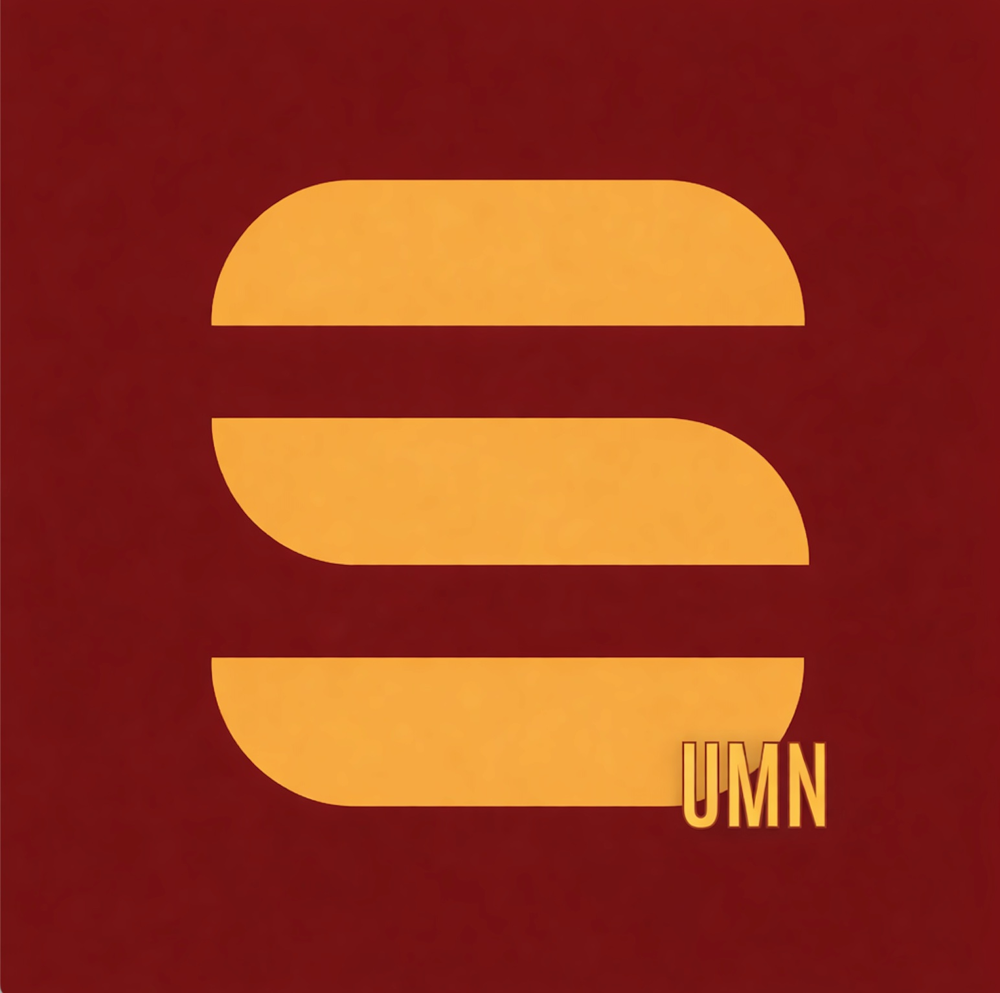

#  ColorStack UMN — Official Website

The official website for the **University of Minnesota Chapter** of [ColorStack](https://www.colorstack.org), a community dedicated to increasing the number of Black, Latinx, and Indigenous technologists who graduate and launch rewarding technical careers.

🔗 **Live Site**: [colorstackumn.org](https://colorstackumn.org)

> **Currently being rebuilt.** The site is mid-revamp against the design bundle in `design/`.
> New here? Start at **[`.ai/README.md`](.ai/README.md)** — slice status, where the spec lives,
> and the gotchas already paid for. Then [`CONTRIBUTING.md`](CONTRIBUTING.md).
> Progress and open blockers live in [`HANDOFF-LOG.md`](HANDOFF-LOG.md); the audit of the old site is [`RECON.md`](RECON.md).

| I want to… | Read |
|---|---|
| Understand the project & current status | [`.ai/README.md`](.ai/README.md) |
| Contribute (human or agent) | [`CONTRIBUTING.md`](CONTRIBUTING.md) — quick start by role |
| Know who owns a path before touching it | [`.ai/OWNERSHIP.md`](.ai/OWNERSHIP.md) |
| See blockers & the work ledger | [`HANDOFF-LOG.md`](HANDOFF-LOG.md) |
| Check the design authority | [`design/UX-SPEC.md`](design/UX-SPEC.md) |
| Review a PR | [`.ai/reviews/README.md`](.ai/reviews/README.md) |

---

## About

ColorStack at the University of Minnesota is an inclusive student organization focused on bolstering the representation and success of underrepresented students within computing disciplines. We leverage UMN's vast resources and the Twin Cities' thriving tech ecosystem to create meaningful change in tech diversity.

**Founded**: 2025

---

## Tech Stack

| Layer | Technology |
|-------|-----------|
| Framework | Astro 5 (static output, zero client JS by default) |
| Styling | Plain CSS with design tokens from `design/tokens/` |
| Fonts | Archivo, Lora, IBM Plex Mono — self-hosted woff2, latin subset |
| Hosting | GitHub Pages · apex domain via `public/CNAME` |

---

## Project Structure

```
colorstack-umn-website/
├── src/
│   ├── styles/         # Token layer, copied from design/tokens/ + base.css
│   ├── layouts/        # Base.astro — imports tokens first
│   ├── components/     # Chrome and primitives
│   └── pages/          # One file per route
├── content/            # events.json, issues.json, team.json, jobs.json
├── public/
│   ├── fonts/          # Self-hosted woff2
│   ├── images/
│   └── CNAME           # colorstackumn.org — must survive every build
├── design/             # Vendored design bundle — never hand-edited
├── CLAUDE.md           # Orchestrator constitution
├── HANDOFF-LOG.md      # Slice ledger + blockers
└── RECON.md            # Audit of the pre-revamp site
```

---

## Local Development

Requires Node `^20.19` or `>=22.12`.

```bash
git clone https://github.com/KhalidMuse45/Colorstack-UMN-Website.git colorstack-umn-website
cd colorstack-umn-website
npm install
npm run dev        # http://localhost:4321
npm run build      # static output to dist/
npm run check      # astro check — types and template diagnostics
```

Brand guardrails run as a pre-commit hook. Enable them once per clone:

```bash
git config core.hooksPath .githooks
```

The hook blocks literal hex values outside the token layer, `outline` suppression without a replacement ring, gradients and glassmorphism, and misspellings of "ColorStack".

---

## Deployment

Deployed via **GitHub Pages**. `public/CNAME` carries the apex domain and is emitted into `dist/` on every build — do not move it back to the repo root.

---

## Roadmap

Tracked as slices in `HANDOFF-LOG.md`.

- [x] Slice 1 — Scaffold, tokens, self-hosted fonts, guardrails
- [ ] Slice 2 — Global chrome (NavBar, MobileSheet, Footer)
- [ ] Slice 3 — Primitives (MetaRow, FigureBlock, EventCard, JoinBlock, …)
- [ ] Slice 4 — Content layer (`content/*.json` + loaders)
- [ ] Slice 5 — Home `/`
- [ ] Slice 6 — `/join` + `/events`
- [ ] Slice 7 — `/newsletter` archive + reader
- [ ] Slice 8 — `/opportunities` + `/about` + `/about/team`
- [ ] Slice 9 — `/sponsor`
- [ ] Slice 10 — Motion, a11y, and performance pass

---

## Contributing

This site is maintained by the **ColorStack UMN Executive Board**. To suggest changes or report issues, please reach out:

- **Email**: [colorstk@umn.edu](mailto:colorstk@umn.edu)
- **LinkedIn**: [ColorStack UMN](https://www.linkedin.com/company/colorstackumn/about/)
- **Instagram**: [@colorstackumn](https://www.instagram.com/colorstackumn/)

---

## License

© 2025 ColorStack — University of Minnesota Chapter. All rights reserved.
